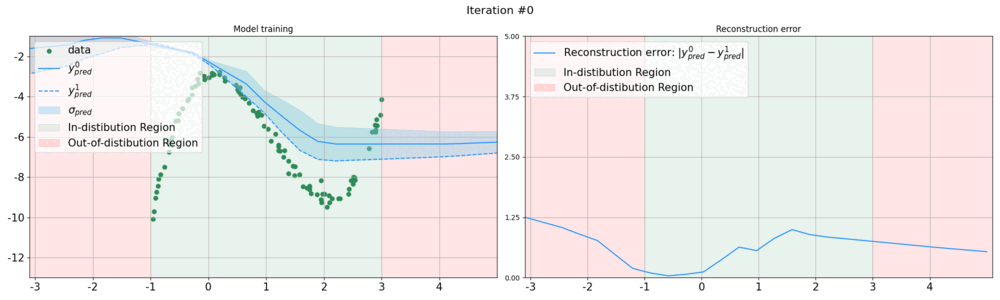
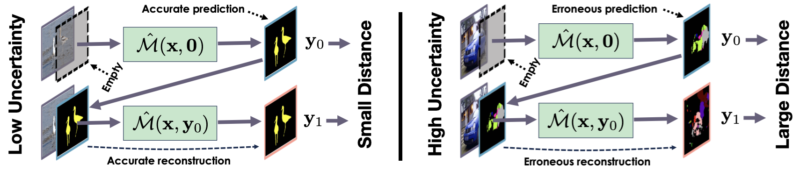

# ZigZag: Universal Sampling-free Uncertainty Estimation Through Two-Step Inference



[](https://arxiv.org/abs/2211.11435)
[](https://www.python.org/downloads/release/python-31014/)
[](https://pytorch.org/)
[](https://github.com/cvlab-epfl/zigzag/blob/main/LICENSE)

### [Project Page](https://www.norange.io/projects/zigzag/) | [OpenReview](https://openreview.net/forum?id=QSvb6jBXML) | [TMLR Paper](https://openreview.net/pdf?id=QSvb6jBXML)

> **For a quick tryout of the ZigZag method, check the Colab notebooks below!**

## Abstract

Whereas the ability of deep networks to produce useful predictions on many kinds of data has been amply demonstrated, estimating the reliability of these predictions remains challenging. Sampling approaches such as MC-Dropout and Deep Ensembles have emerged as the most popular ones for this purpose. Unfortunately, they require many forward passes at inference time, which slows them down. Sampling-free approaches can be faster but often suffer from other drawbacks, such as lower reliability of uncertainty estimates, difficulty of use, and limited applicability to different types of tasks and data.

In this work, we introduce a sampling-free approach that is generic and easy to deploy, while producing reliable uncertainty estimates on par with state-of-the-art methods at a significantly lower computational cost. It is predicated on training the network to produce the same output with and without additional information about it. At inference time, when no prior information is given, we use the network's own prediction as the additional information. We then take the distance between the predictions with and without prior information as our uncertainty measure.

## TL;DR



**ZigZaging:** At inference time, we make two forward passes. First, we use $[\mathbf{x}, \textbf{0}]$ as input to produce a prediction $\mathbf{y}\_{0}$. Second, we feed $[\mathbf{x}, \mathbf{y}\_{0}]$ to the network and generate $\mathbf{y}\_{1}$. We take $\| \mathbf{y}\_{0} - \mathbf{y}\_{1} \|$ to be our uncertainty estimate. In essence, the second pass performs a reconstruction in much the same way an auto-encoder does and a high reconstruction error correlates with uncertainty.

**Motivation:** The second pass reconstructs the second input, expecting lower error for in-distribution data and higher for out-of-distribution, enabling uncertainty estimation. When given a correct label with input , the network, trained to minimize the difference between outputs, indicates in-distribution data. If is incorrect, this out-of-distribution sample prompts an unpredictable response, which we use to gauge uncertainty. This mechanism addresses both epistemic uncertainty when is OOD and aleatoric uncertainty when is errornous. 

## Implementation

Integrating ZigZag into standard models is notably straightforward, requiring only minimal modifications to the first layer to accept an additional input. This simplicity enables the model to efficiently make two types of predictions—initially without and then with its own previous outputs as inputs. 

**Original architecture:**
```python 
class MLP(nn.Module):
    def __init__(self, in_features, out_features):
        super().__init__()
        self.out_features = out_features

        self.input = nn.Linear(in_features, 8)
        self.hidden1 = nn.Linear(8, 16)
        self.hidden2 = nn.Linear(16, 8)
        self.output = nn.Linear(8, out_features)

        self.activation = nn.ReLU()

    def forward(self, x, y=None):
        x = self.activation(self.input(x))
        x = self.activation(self.hidden1(x))
        x = self.activation(self.hidden2(x))
        return self.output(x)
```
**Modified architecture:**
```python 
class ZigZagMLP(nn.Module):
    def __init__(self, in_features, out_features):
        super().__init__()
        self.out_features = out_features

        # Modifying the first layer
        self.input = nn.Linear(in_features + out_features, 8)
        self.hidden1 = nn.Linear(8, 16)
        self.hidden2 = nn.Linear(16, 8)
        self.output = nn.Linear(8, out_features)

        self.activation = nn.ReLU()

    def forward(self, x, y=None):
        # Adding the second input
        if y is None:
            batch = x.shape[0]
            y = torch.zeros((batch, self.out_features))
        x = torch.cat([x, y], dim=1)

        x = self.activation(self.input(x))
        x = self.activation(self.hidden1(x))
        x = self.activation(self.hidden2(x))
        return self.output(x)
```

## Installation 

TBD

## Experiments

### 1D Regression 

**Uncertainty Estimation for Regression:** The task is to regress $y$-axis values for $x$-axis data points drawn from the range $x \in [-1, 3]$ using a third-degree polynomial with added Gaussian noise. The method displays higher uncertainty or reconstruction error for out-of-distribution inputs and lower for in-distribution samples.

[](https://colab.research.google.com/github/cvlab-epfl/zigzag/blob/main/exps/notebooks/toy_regression.ipynb)

### UCI Datasets Regression

We trained three different models—ZigZag, an ensemble of simple MLPs, and MC Dropout—on various UCI datasets including Boston Housing, Yacht, Power Plant, and Energy to predict their respective target variables. We split the data into in- and out-of-distribution samples based on the values of a specific feature. We then used uncertainty measures and AUC metrics to evaluate the accuracy of uncertainty predictions.

[](https://colab.research.google.com/github/cvlab-epfl/zigzag/blob/main/exps/notebooks/uci_regression.ipynb)

### MNIST Classification

**MNIST vs FashionMNIST:** We train the networks on MNIST and compute the accuracy and calibration metrics (rAULC). We then use the uncertainty measure they produce to classify images from the test sets of MNIST and FashionMNIST as being within the MNIST distribution or not to compute the OOD metrics, ROC- and PR-AUCs. We use a standard architecture with several convolution and pooling layers, followed by fully connected layers with LeakyReLU activations.

[](https://colab.research.google.com/github/cvlab-epfl/zigzag/blob/main/exps/notebooks/mnist_classification.ipynb)

### CIFAR Classification

**CIFAR10 vs SVHN:** We trained on CIFAR10, evaluating accuracy and calibration. Uncertainty measures help classify images from CIFAR10 and SVHN test sets for out-of-distribution (OOD) analysis, using ROC and PR-AUC metrics. We utilized the Deep Layer Aggregation (DLA) network, known for superior performance over models like ResNet or VGG, particularly effective in small training sets to avoid overfitting. OOD samples were drawn from SVHN, featuring distinct classes like road sign digits.

[]()

### Airfoils Regression

**Lift-to-drag prediction:** We trained a Graph Neural Network (GNN) on a dataset of 2,000 NACA wing profiles to predict their lift-to-drag coefficients, using parameters and aerodynamic simulations provided by XFoil. We reserved the top 5% of profiles with the highest lift-to-drag ratios as out-of-distribution (OOD) samples to test the model's robustness. The training set consisted of 80% of the remaining profiles, with the rest used for testing, all spanning lift-to-drag values from 0 to 60. The GNN features 25 GMM layers with ELU nonlinearities and skip connections, optimizing for both predictive accuracy and effective OOD detection.

[]()

## Citation

If you find this code useful, please consider citing our paper:

> Durasov, Nikita, et al. "ZigZag: Universal Sampling-free Uncertainty Estimation Through Two-Step Inference." TMLR 20224.

```bibtex
@article{durasov2024zigzag,
    title = {ZigZag: Universal Sampling-free Uncertainty Estimation Through Two-Step Inference},
    author = {Nikita Durasov and Nik Dorndorf and Hieu Le and Pascal Fua},
    journal = {Transactions on Machine Learning Research},
    issn = {2835-8856},
    year = {2024}
}
``` 
